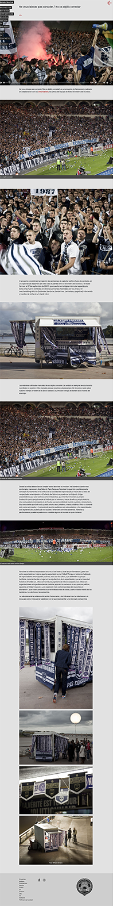
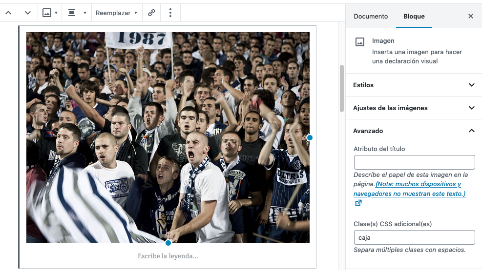
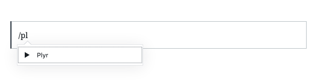
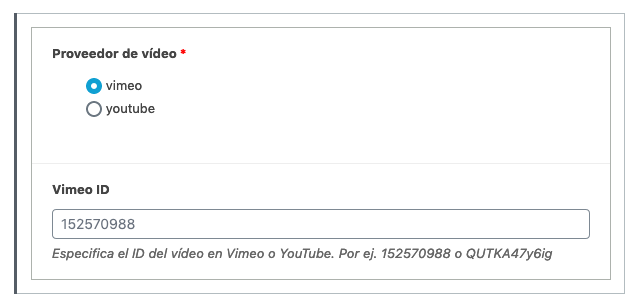
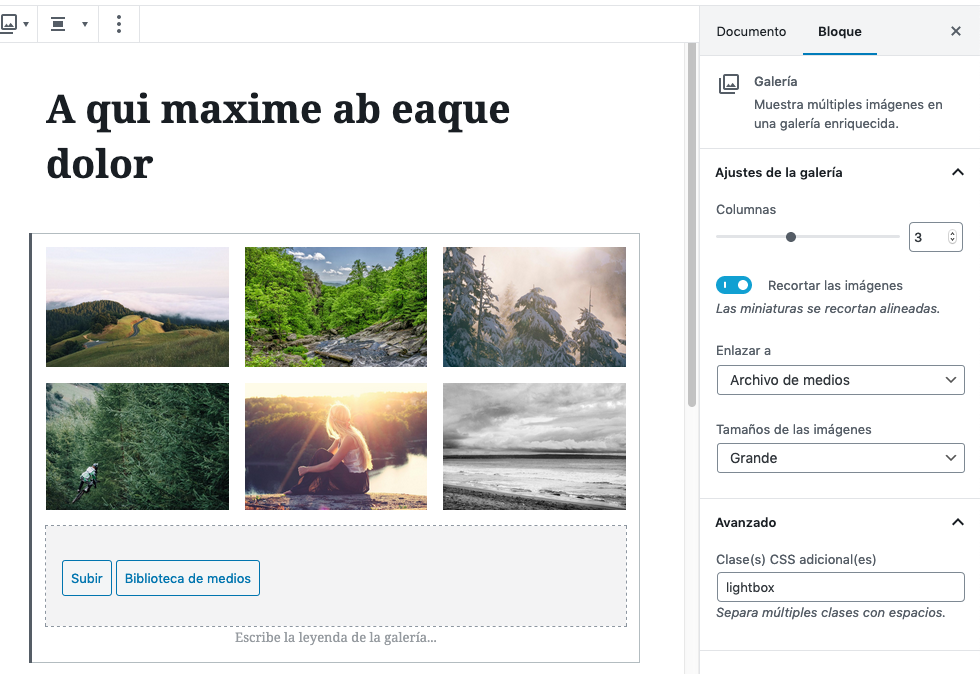

# Entradas

## Introducción

Esta sección se explican ciertas características del editor de bloques que son comunes a distintos tipos de posts como [Proyectos](tipos-de-contenido.md#proyectos) o [Noticias](tipos-de-contenido.md#noticias)

El editor de bloques Gutenberg ofrece elasticidad y posibilidades de composición pero exige cierto cuidado para mantener la coherencia en el aspecto. Se indican aquí algunas técnicas para controlar su apariencia.

## Layout

En términos generales, la diagramación del contenido para móviles se hace en una columna que ocupa todo el ancho del viewport y, para ordenadores de escritorio se utiliza una diagramación que combina elementos dispuestos en una caja central con otros que ocupan toda la pantalla. A estos últimos los llamaré elementos "a sangre", trasladando (incorrectamente) el término desde la edición impresa.

La disposición de los textos, para evitar que los renglones se hagan excesivamente largos, se componen a caja por defecto. Las imágenes y galerías de imágenes pueden disponerse a caja o a sangre, opcionalmente.

Este es un ejemplo de entrada con textos, imágenes y vídeos que combina las dos opciones, caja y sangre.

Las imágenes y vídeos aparecerán por defecto a sangre. Si se quiere cambiar el comportamiento, hay que introducir una clas "caja" en el bloque. Para ello, sigue estos pasos.

1. Selecciona el bloque (imagen, video o galería) que deseas poner a caja.
2. Selecciona la pestaña "Bloque" en la columna de la derecha.
3. Introduce el texto "caja" en el campo "Clase CSS", tal y como se indica en la imagen a continuación.

## Video

Para incrustar video se ha creado un bloque específico de vídeo que incorpora la posibilidad de incrustar video desde Vimeo o Youtube. La razón para no utilizar el bloque de vídeo que trae por defecto WordPress es unificar sus interfaces gráficas y tener más control sobre su apariencia.

Para incrustar un vídeo de vimeo o youtube sigue estos pasos.

1. Empieza a escribir un bloque. Con la barra inclinada seguida de "plyr".
2. Elige el bloque "Plyr", especifica el proveedor de vídeo y su identificador.

## Lightbox

Si se quiere mostrar una galería de imágenes de forma que sus imágenes encajen en la pantalla del usuario, es conveniente usar la opción lightbox de la galería. Estos son los pasos.

1. Incorpora una galería de imágens de forma estándar con WP.
2. Elige "Enlazar a archivo de medios"
3. En la sección "Avanzado" introduce el texto "lightbox" en el campo "Clases CSS"

Esto activará el interfaz del lightbox para esa galería en el front-end.