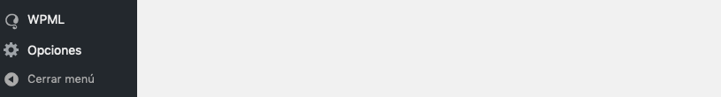
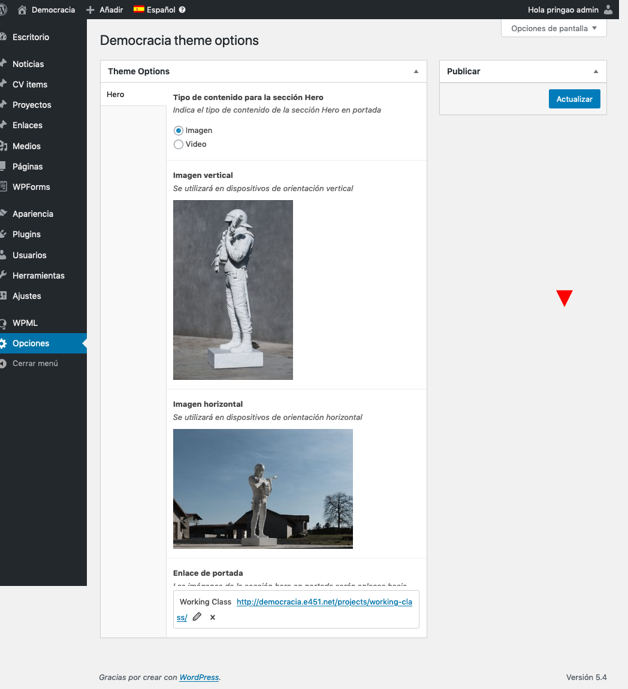
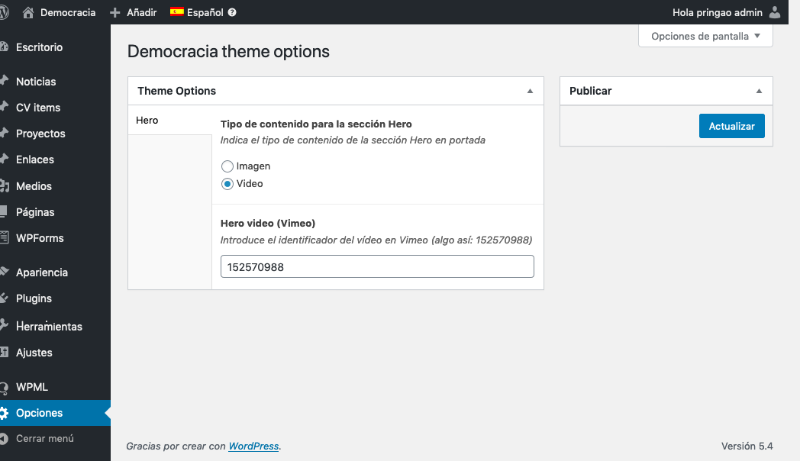

# Front page

La página principal muestra un contenido que puede ser un vídeo o una imagen.

En el caso de elegir una imagen es necesario indicar una imagen para dispositivos verticales y otra para horizontales.

También en el caso de elegir una imagen, ésta será un enlace hacia un contenido. Por tanto, hay que indicar qué contenido se quiere enlazar.

Estos detalles se especifican en la pestaña "Opciones" en la columna lateral izquierda.

## Imagen

El interfaz se explica por sí mismo. Hay que subir una imagen vertical, otra horizontal y especificar la URL a la que apuntarán.

## Video

El vídeo de portada sólo admite enlaces a Vimeo. Hay que especifiar sólo el identificador del vídeo, no el enlace entero.

