# Tipos de contenido

[[toc]]

## Información general

En lo que concierne al front-end, es decir, al aspecto de la página, podemos encontrar distintos tipos de contenidos editables diferenciados como items de menú:

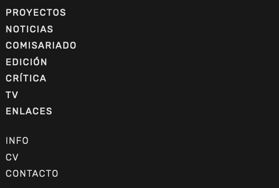

Sin embargo estos tipos de contenido no tienen una correlación directa con los tipos de contenido en en el back-end. Es decir, la estructura de la información en el back-end difiere ligeramente. Por ese motivo, el editor de WordPress muestra su propia estructura de tipos de contenido:

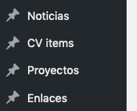

Para poder añadir o editar contenidos es necesario conocer la correlación entre unos y otros:

* **[Proyectos](#proyectos)** es del tipo `Proyecto`
* **[Noticias](#noticias)** es del tipo `Noticia`
* **[Comisariado](#comisariado)** es del tipo `Proyecto`
* **[Edición](#edicion)** es del tipo `Proyecto`
* **[Crítica](#cCritica)** es del tipo `Enlace`
* **[TV](#tv)** es del tipo `Enlace`
* **[Enlaces](#enlaces)** es del tipo `Enlace`
* **[Info](#info)** es del tipo `Página`
* **[CV](#cv)** es del tipo `CV item`
* **[Contacto](#contacto)** es del tipo `Página` 

## Proyectos

Para introducir un proyecto nuevo ha de utilizarse el tipo de contenido `Proyecto`.

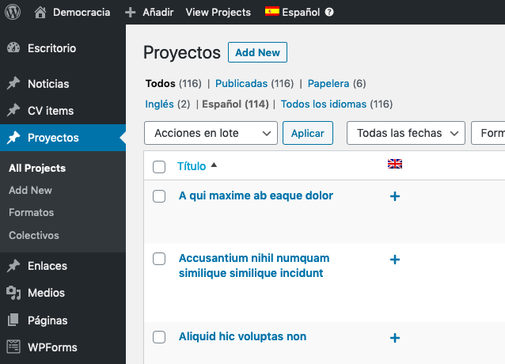

Para editar los contenidos en el editor de bloques pueden seguirse [las directrices generales para las entradas](./entradas). Aparte, hay que añadir la siguiente información específica:

Seleccionar la pestaña "Documento", no la de "Bloque", en la columna lateral derecha.

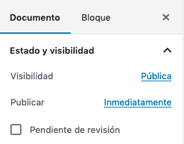

### Formatos

Especificar los formatos que se quieren asignar al proyecto.

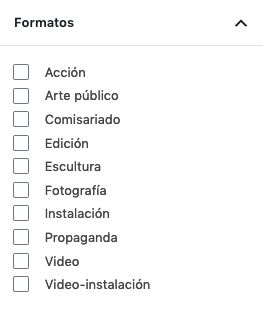

### Colectivo

Especificar el colectivo al que pertenece el proyecto. Esto hará que se ordene adecuadamente en su lugar.

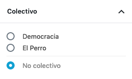

### Fecha de producción y ficha técnica

Esta información se especifica debajo del editor de bloques.

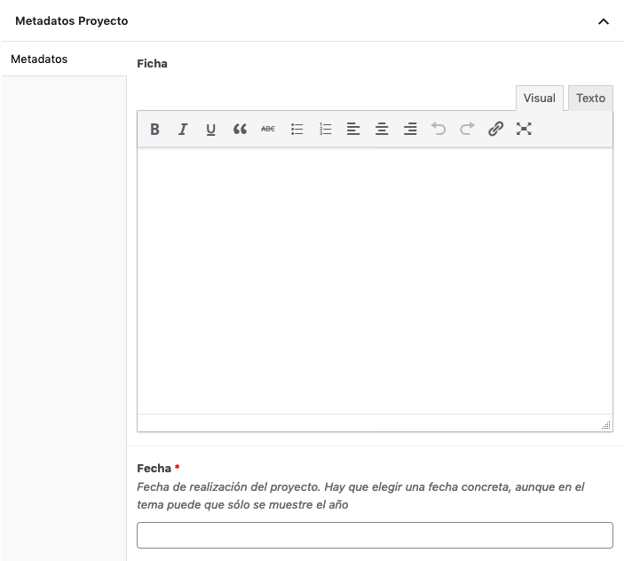

La fecha de producción es diferente de la fecha de publicación, no hay que confundirlas. La fecha de producción es el momento en el que se hizo el trabajo. Sirve para ordenar los proyectos por fecha y, aunque actualmente sólo se muestra el año en el front-end, hay que especificar el día y el mes en el desplegable.

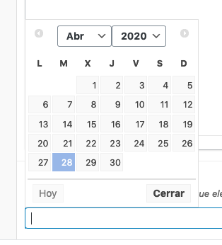

Aunque no es relevante para proyectos, la fecha de publicación puede modificarse en la columna lateral derecha.

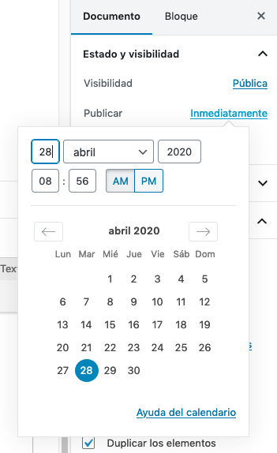

Estos elementos (Fecha de producción, ficha técnica y formatos) se recopilan en una ficha de metadatos que aparece asociada a cada proyecto en el front-end bajo el epígrafe "info".

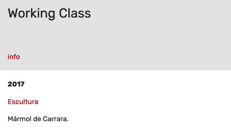

### Imagen destacada

Se utiliza para el desplegable de la página de archivo. Debe seguir las [directrices generales para imágenes](./imagenes).

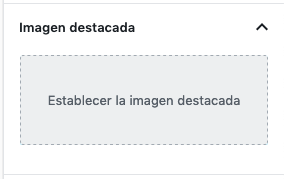

## Noticias

Para introducir una noticia nueva ha de utilizarse el tipo de contenido `Noticia`.

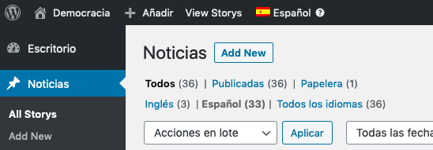

Las noticias no tienen personalizaciones. Se utilizan de la forma habitual en WordPress. Únicamente hay que tener en cuenta que necesitan tener imagen destacada y extracto para la portada de noticias.

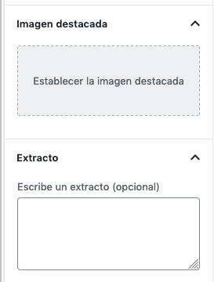

Para el contenido pueden seguirse [las normas generales del editor de bloques](./entradas.md).

## Comisariado

Para introducir un proyecto de comisariado nuevo ha de utilizarse el tipo de contenido `Proyecto`. Al ser una entrada de tipo proyecto, han de seguirse las mismas directrices que se han explicado [en la sección Proyectos](#proyectos) con la única excepción de especificar el formato "comisariado". Esto hará que se ordene en la pestaña Comisariado y se excluya de la portada de Proyectos.

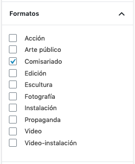

## Edición

Para introducir un proyecto editorial nuevo ha de utilizarse el tipo de contenido `Proyecto`. Al ser una entrada de tipo proyecto, han de seguirse las mismas directrices que se han explicado [en la sección Proyectos](#proyectos) con dos excepciones:

* Especificar el formato "edición". Esto hará que se ordene en la pestaña Edición y se excluya de la portada de Proyectos.
* Introducir texto en el campo "extracto", en la columna lateral derecha.

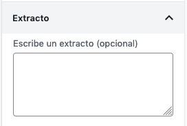

## Enlaces

Para introducir un enlace nuevo a la sección "Enlaces" hay que usar el tipo de contenido `Enlace`.

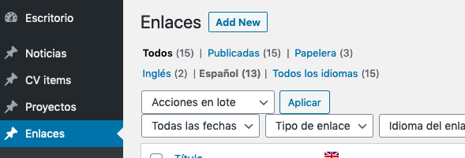

Si se quiere que el enlace apunte a un sitio concreto, hay que introducir la URL de destino en el campo habilitado para ello. De otra forma, el título del post apuntará a la entrada dentro de la propia web.

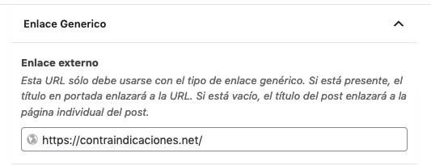

Para que un enlace se ordene dentro de la pestaña Enlaces es necesario especificar "genérico" en el tipo de enlace.

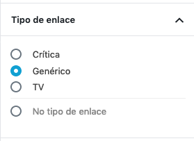

Es importante en el enlace genérico dejar vacío el "idioma del enlace", ya que esto provocaría que se añadiera automáticamente a la pestaña "Crítica".

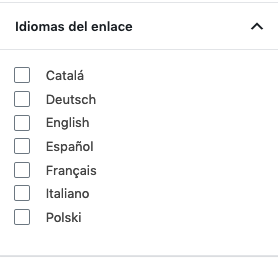

El contenido de cada enlace que aparece en la sección Enlaces es el contenido del editor de bloques de Gutenberg. Por ejemplo, este contenido:

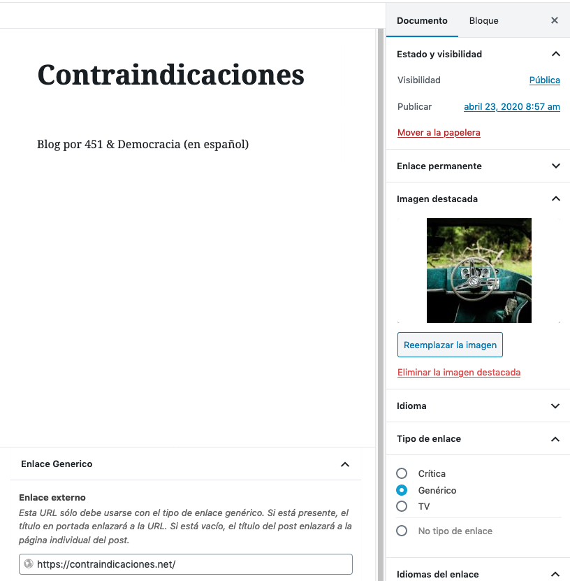

Será interpretado así en el front:

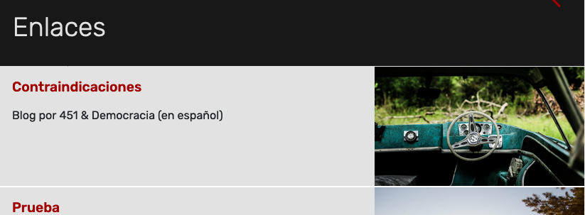

## Crítica

Para introducir una nueva crítica a la sección "Crítica" hay que usar el tipo de contenido `Enlace`. Pueden seguirse [las indicaciones para introducir el enlace genérico](#enlaces) excepto que deberán tener marcada la opción "Crítica" en el tipo de enlace.

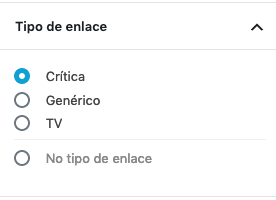

Las entradas de este tipo se ordenarán bajo el epígrafe de su idioma, que se determina en la taxonomí "idiomas de enlace".

Este tipo de enlace no hace uso de la imagen destacada ni del extracto.

## TV

Para introducir una nueva entrada a la sección "TV" hay que usar el tipo de contenido `Enlace`. Pueden seguirse [las indicaciones para introducir el enlace genérico](#enlaces) excepto que deberán tener marcada la opción "TV" en el tipo de enlace.

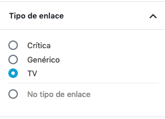

Estas entradas se comportan como una entrada estándar de WP. Si se quiere introducir un vídeo incrustado, puede utilizarse el bloque de Gutenberg "Vídeo", tal como se explica en [las instrucciones para la edición de entradas](./entradas).

Como peculiaridad, estas entradas se organizan en forma de mosaico de imágenes en su sección. Las imágenes que se utilizan para el mosaico son las imágenes destacadas.

Hay que seguir la [norma general para las imágenes](./imagenes) y, además, es importante elegir unas proporciones iguales para todas ellas. Por ejemplo, 2000 pixels de ancho x 1200 pixels de alto. De otra forma, las imágenes se distorsionarán para igualarse en altura. 

## Info

La sección info se construye con el tipo de contenido `Página`. Puede verse y editarse en la sección Páginas.

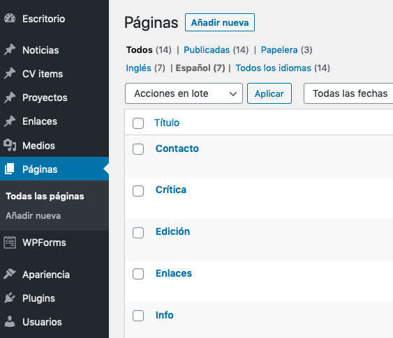

## CV

Para introducir una nuevo item en el currículo ha de utilizarse el tipo `cv`.

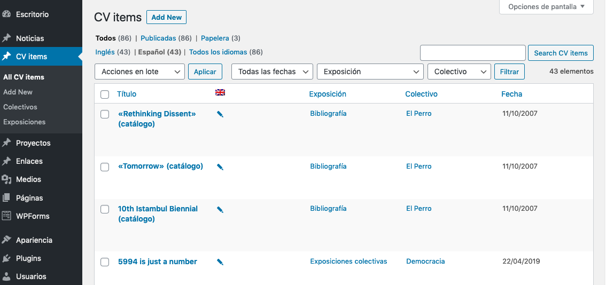

Estos items se organizan automáticamente bajo el epígrafe de su año de producción y, dentro de cada año, por el tipo de exposición (individual o colectiva). Al final de la página aparecerán los items marcados como bibliografía.

Cada item consta de un título (el título de la entrada) y un contenido (el contenido del editor de bloques de Gutenberg). Un item correctamente introducido tiene este aspecto.

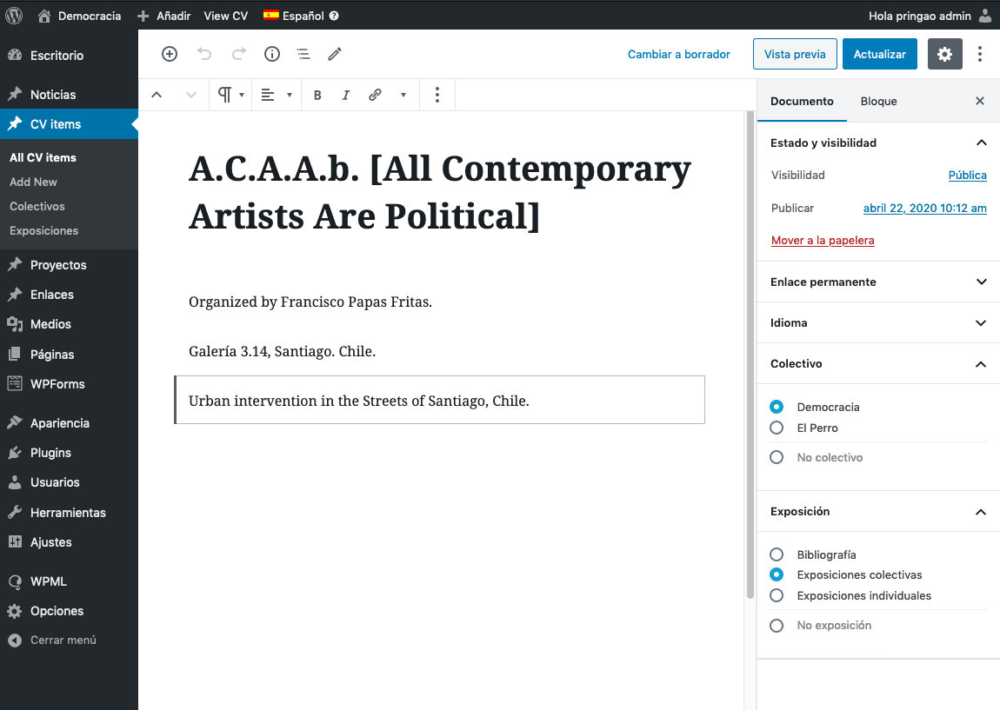

Por tanto, es imprescindible itroducir estos tres elementos:

**1. La fecha**. Se utiliza la fecha de publicación estándar de WP en la columna derecha.

**2. El colectivo**

**3. el tipo de exposición**

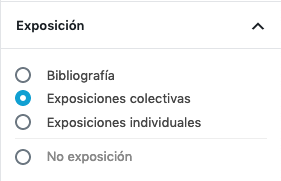

## Contacto

La página de contacto es del tipo `Página`, pero si se edita sólo se verá el shortcode del formulario de contacto. Dicho formulario está construido con el plugin WP-forms y, en consecuencia, cualquier edición debe ejecutarse en la pestaña del plugin.

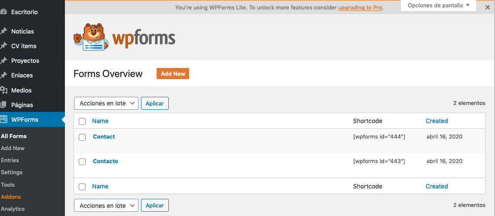

[Más info en la documentación del plugin](https://wpforms.com/docs/).

